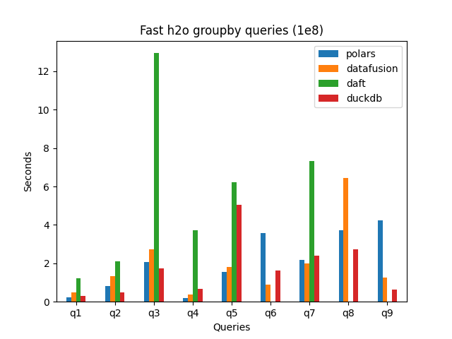

# QueryBench

QueryBench provides high-quality benchmarks for popular engines, so you can easily identify the best tool for your workloads.

For example, here's an example of some groupby queries on a 100 million row dataset with various engines:

We can see that some engines outperform for some queries and underperform for others.  We can also see that some engines generally outperform for this particular methodology.

These results are useful for different audiencies:

* companies that want to select the best engine for their workloads
* query engine developers who want to optimize the performance of their engine

## QueryBench methodology

QueryBench provides many types of benchmarks to account for tradeoffs with different engines.

Here are some guiding principles:

1. show the good and bad side of each engine
1. use columnar file formats
2. benchmark total runtime, including time it takes to load into memory
3. don't allow a single query to bias the overall results

## Why benchmarks are important

Analyzing modern query engines and choosing the right tool for the job takes a lot of time and effort.  It's easier to determine the best options based on reliable benchmarks, determine the engine with functionality that matches your workflows, and start by trying out the best performing engine.

Suppose you'd like to find the quickest way to join a 2GB CSV file with a 1GB Parquet file on your local machine.

You may not want to perform an exhaustive analysis yourself.  You'll probably find it easier to look up some benchmarks and make and informed decision on the best alternative.

Trying out 10 different options that require figuring out how to use various different programming languages isn't realistic.  Benchmarks serve to guide users to good options for their uses cases, keeping in mind their time constraints.

Benchmarks can be harmful when they're biased or improperly structured and give misleading conclusions.  Benchmarks should not intentionally or unintentionally misguide readers and towards suboptimal technology choices.

Benchmarks should also pave the way for revolutionary technologies to gain adoption.  When a new query engine figures out how to process data in a faster, more reliable manner, they should be able to quantify improvements to users via benchmarks.  This helps drive adoption.

## The best query engine depends on many factors

Choosing the best engine is multifaceted, so the performance of the engine for certain queries isn't the only decision factor.

Here are other important factors to consider:

* OLTP vs. OLAP query patterns
* ad hoc vs. consistent querying
* skill set and preferences of your team

QueryBench aims to provides many types of benchmarks so you can identify the best engine for your team.  It strives to call out biases for the different query patterns rather than hide these important details.
