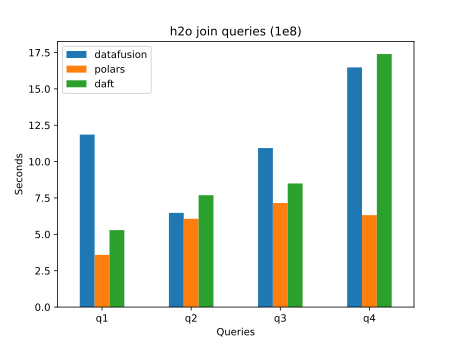
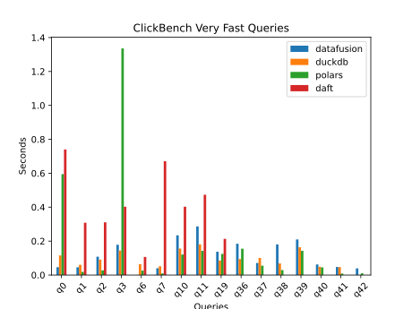
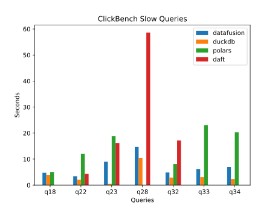
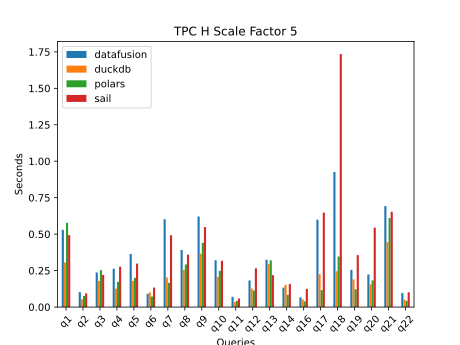
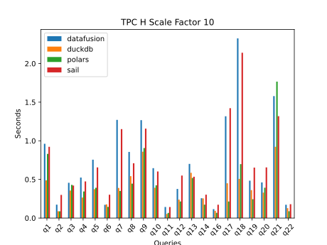
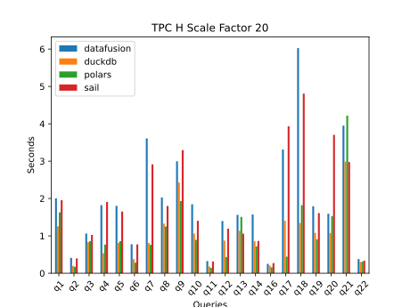
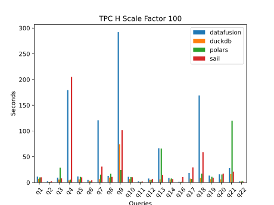
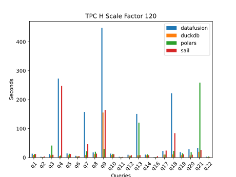

# QueryBench

QueryBench provides high-quality benchmarks for popular engines, so you can easily identify the best tool for your workloads.

Here are the QueryBench single table results on the 1e8 table:

## h2o benchmark results

This section shows the h2o benchmarks with the QueryBench execution methodology.

Here are the h2o groupby query runtimes on a 100 million row (1e8) dataset with various engines:

Here are the h2o groupby query runtimes on the 1e8 table that run slower:

Here are the h2o join query runtimes for the 1e8 table that run slower:

## ClickBench results

Here are the ClickBench results with the QueryBench methodology:

## TPC H benchmark results

Here are the TPC H query results for various scale factors.

## How to analyze the QueryBench results

You can see that the benchmarks provide mixed results.

You need to dig into the details a bit when you're selecting the best engine for your workflows.

Don't rely on overly simplistic studies that reduce benchmarks to a single graph - that's usually too simplistic for an intricate decision.

## QueryBench project goals

QueryBench is helpful for different types of users:

* Help practitioners select fast engines for their workflows
* Allow query engine maintainers to identify areas of improvement
* Provide benchmarking best practices for the data industry

## Why benchmarks are important

Benchmarks are essential for a few reasons:

* You are more productive when your queries run faster
* You save money when your queries run faster on virtual machines
* Efficient engines can handle computationally intense queries that cause inefficient engines to error out

Analyzing modern query engines and selecting the right tool for the job requires considerable time and effort.  It's easier to determine the best options based on reliable benchmarks, determine the engine with functionality that matches your workflows, and start by trying out the best-performing engine.

Suppose you'd like to find the quickest way to join a 2 GB CSV file with a 1 GB Parquet file on your local machine.

You may not want to perform an exhaustive analysis yourself.  You'll find it easier to look up some benchmarks and make an informed decision on the best alternative.

Trying out 10 different options that require figuring out how to use various programming languages isn't realistic.  Benchmarks serve to guide users to informed choices for their use cases, taking into account their time constraints.

Benchmarks can be harmful when they're biased or improperly structured, yielding misleading conclusions.  Benchmarks should not intentionally or unintentionally mislead readers into making suboptimal technology choices.

Benchmarks should also pave the way for revolutionary technologies to gain adoption.  When a new query engine determines how to process data more efficiently and reliably, it should be able to quantify these improvements to users through benchmarks.  This helps drive adoption.

## The best query engine depends on many factors

Choosing the best engine is multifaceted, so the performance of the engine for specific queries isn't the only decision factor.

Here are other essential factors to consider:

* OLTP vs. OLAP query patterns
* ad hoc vs. consistent querying
* skill set and preferences of your team

QueryBench aims to provide a variety of benchmarks, enabling you to identify the fastest engine for your team.  It strives to highlight potential biases associated with different query patterns rather than hiding these essential details.

## Query engine speed isn't the only factor

Please make sure that you put these results into perspective and remember that query engine speed is not the only important factor when selecting a query engine.

Here are some other essential factors:

* library ecosystem: you may want to use a specific engine that's compatible with a vital library you need for an analysis
* team skill set: your team may only know Python, so a Java engine isn't a good option for them
* team preferences: your team may be passionate about the tidyverse and R programming language, so it may not be worth switching to a different ecosystem
* data set size: your data may be large, so you have to use a big data engine.  Alternatively, if your data is small, there is no need to worry about running a distributed engine.

If you follow the Lakehouse architecture, you can use many engines.

## You can use many engines

You don't need to use only a single engine.

You can use one engine to run part of a data pipeline and then pass off the analysis to another engine to get the best of both worlds.

## Why the data industry is skeptical of benchmarks

The data community is tired of VendorX publishing biased benchmarks that show that their QueryEngineX is the best for all workflows.

You've probably seen the common errors:

* a study that tunes the queries for QueryEngineX and doesn't tune the other engines
* carefully selected queries that work exceptionally well for a specific engine
* hardware that works best for their query engine
* using engines far from their designed purpose, like using an engine that's built to be distributed amongst many nodes in a cluster on a single node
* using a file format such that filesystem I/O takes more time than actually executing the query
